# Tai-e项目框架

目前已经实现了Live Variable analysis和Constant Propagation analysis两种函数内的分析了，现在先来借由此来解析一下Tai-e的框架的使用方法

这里重点以Constant Propagation analysis为例

二者的目录结构是几乎相似的

【框架目录结构】

首先是如下的三个结构

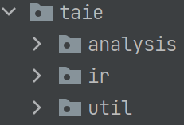

- 其中analysis是用于分析的内容
- ir部分会将整个程序转化成中间表示，在Tai-e中采用的是3AC的表示方式

## Util

Util就是工具类，在两个例子中，都列出了统一的工具 graph

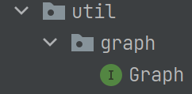

因为需要建立CFG，甚至后续的Call Graph，本质上就是Graph，因此可以使用这个通用的Graph

```java
public interface Graph<N> extends Iterable<N>
```

其接口如下

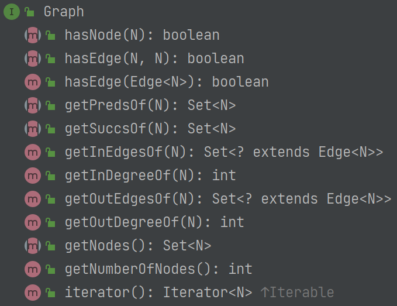

在后续会知道，CFG的接口和这些是非常类似的

## IR

（IR中的内容都是框架提供的，我们只需要能够看懂其中的源码，得知其接口就可以了，静态分析是在3AC IR的基础上进行的，不需要对IR的接口进行操作）

IR的结构如下

| Live Variable                                                | Constant Propagation                                         |
| ------------------------------------------------------------ | ------------------------------------------------------------ |
| 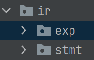 | 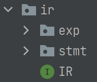 |

- 其中IR表示一整个方法的所有中间表示，包括获取方法JMethod, 参数，还有Statement等等所有的内容

如下是其接口

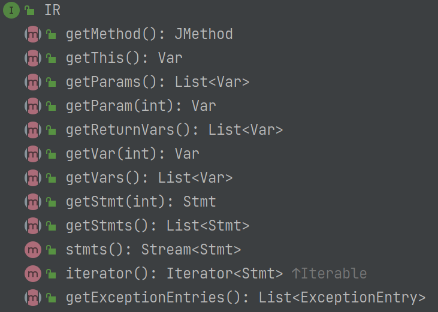

#### Stmt

stmt包中表示Statement，即原先每个Statement的抽象表示，利用其可以获得每个Statement的信息，接口如下

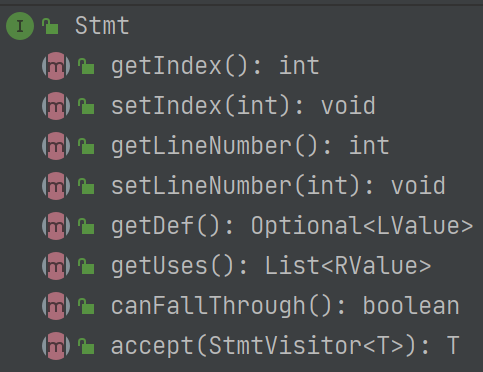

对于不同的statement，也可以判断不同的类型，有些是赋值语句，有些是函数调用等等，每个statement的涉及的变量也不尽相同

可以使用`getDef()`来获取左边的变量，getUses()获取右边的变量

每条 Stmt 至多只可能定义一个变量、而可能使用零或多个变量，因此我们使用 **Optional** 和 **List** 包装了 **getDef()** 和 **getUses()** 的结果。

> 每个statement都有toString()方法，打印原先的3AC的表示，可以用于调试，例如"return", "a = a + b"等等操作

#### Exp

> Expression就是可以理解为有值的式子，包括变量，字面量，二元计算式，函数调用等等，这是==**用于对statement做详细操作的方式**==，因为一个statement主要是由Expression构成的

这是 Tai-e 的 IR 中的一个关键接口，用于表示程序中的所有表达式。它含有很多子类，对应各类具体的表达式。下面是一个 Exp 类继承结构的简单图示：

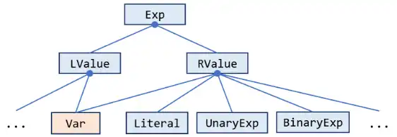

在 Tai-e 的 IR 中，我们把表达式分为两类：LValue 和 RValue。前者表示赋值语句左侧的表达式，如变量（`x = … `）、字段访问（`x.f = …`）或数组访问（`x[i] = …`）；后者对应地表示赋值语句右侧的表达式，如数值字面量（`… = 1;`）或二元表达式（`… = a + b;`）。而有些表达式既可用于左值，也可用于右值，就比如变量（用Var类表示)。因为本次作业只进行活跃变量分析，所以你实际上只需要关注 `Var` 类就足够了。

在Live Variable中仅仅涉及Var，所以除了Exp之外只需要有Var即可

| Live Variable                                                | Constant Propagation                                         |
| ------------------------------------------------------------ | ------------------------------------------------------------ |
| 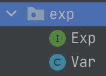 | 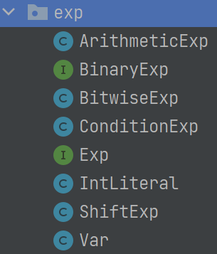 |

但是在Constant Propagation中，其需要对每个statement的a = exp的exp进行计算，其中Exp包括Var，Literal(这里仅仅包含int literal)以及二元表达式，因此这里都列出来了

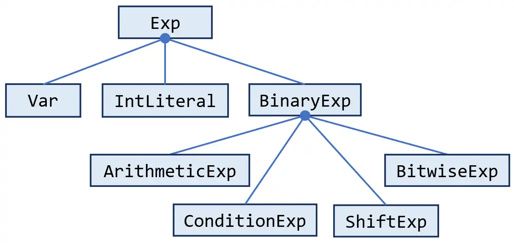

总之，Exp是用于帮助对statement的操作的，因为后续的Transfer function都是基于statement的，本质上是基于statement的行为的，可以通过获取exp来得到statement的行为

> 每个Exp也有对应的toString()方式，表示对应在3AC中的内容，例如a << b

## Analysis

analysis包中是进行分析的主要内容，编译器前面的工作在得到IR之后，静态分析就是在IR的基础上进行的

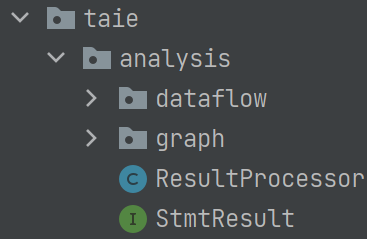

后续的ResultProcessor是不需要关心的，在分析之后对结果仅处理，例如以合适的格式输出等等

### Graph

因为静态分析是要利用编译产生的IR后构成的CFG上进行的，这里提供了CFG的结构，具体的内容在jar包中存在，但是不需要我们了解，只需要知道接口结课

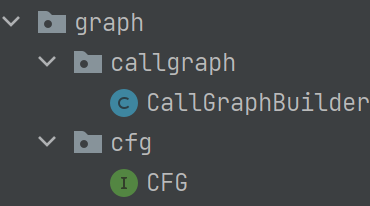

### dataflow

这是最关键的内容，对于不同的分析应用的修改主要是在这个包内

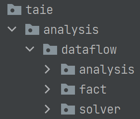

下面的内容着重分析dataflow包内的内容，下面就不按照包内的顺序分析了，根据data-flow analysis讲解的内容介绍

## Dataflow Packet

### Abstraction (Data)

data-flow analysis分析的内容是

- How **application-specific Data** **Flows** through the 
    - Nodes (BBs/statements) and 
    - Edges (control flows) of
    - CFG (a program)?

其中**application-specific Data**就是要抽象的内容

- 在Live Variable analysis中抽象的数据就是Var
- 在Constant Propagation analysis中抽象的数据就是`<Var, Value>`d的Pair

这个的的内容在Fact中体现

### Fact

> Fact包中的内容也是通用的，即在写分析的时候需要调用但是不需要修改的，因此一般不需要关注其中的内容

#### DataFact

对于每一个节点，其OUT或者IN都应该是一个Var或者Pair的结合，如果仅仅是一个Var，那么DataFact就可以用Set表示，如果是Pair，那么就可以用一个Map来表示

所以在Fact处有两种接口**SetFact**和**MapFact**，两个应用分别使用这两种接口，使用起来就和Set和Map是一样的

| Live Variable                                                | Constant Propagation                                         |
| ------------------------------------------------------------ | ------------------------------------------------------------ |
| 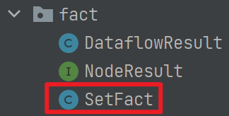 | 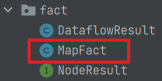 |

SetFact和MapFact没有继承其他的类，是自定义的集合类，用于表示一个节点的**Node**

#### DataFlowResult

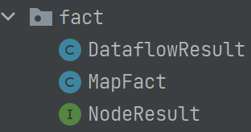

data-flow analysis的目的是什么？如下是第一种说法

1. In each **data-flow analysis** application, we associate with every **program point** a **data-flow value** that represents an **abstraction** of the set of all possible **program states** that can be observed for that point.

因此DataFlowResult的作用就是这样，==**Node和Fact的Map**==

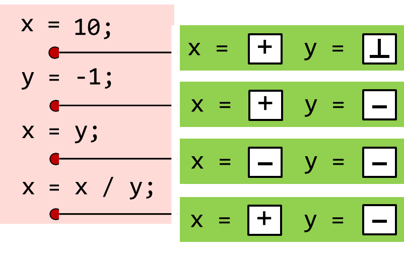

```java
public class DataflowResult<Node, Fact> implements NodeResult<Node, Fact> {

    private final Map<Node, Fact> inFacts = new LinkedHashMap<>();

    private final Map<Node, Fact> outFacts = new LinkedHashMap<>();
}
```

这也是最终要求的内容

#### NodeResult

其中还有一个NodeResult的接口，主要的方式有下

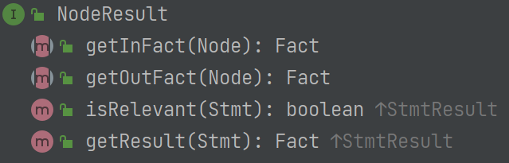

### analysis

如下是Analysis包中的内容

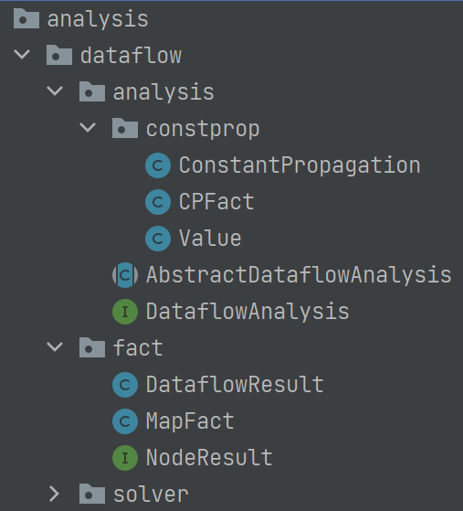

其中DataflowAnalysis和AbstractDataflowAnalysis如下，这两个类都是通用的，不需要修改，不同的分析都需要以这两个为模板，最终solver也仅仅是调用这两个模板

| DataflowAnalysis                                             | AbstractDataflowAnalysis                                     |
| ------------------------------------------------------------ | ------------------------------------------------------------ |
| 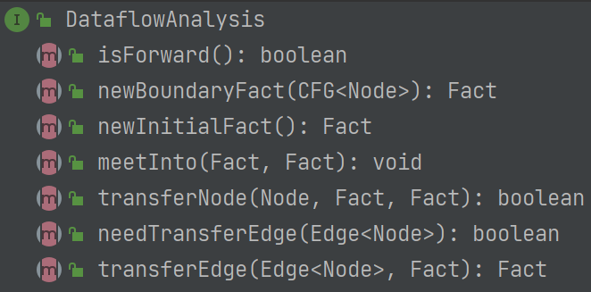 | 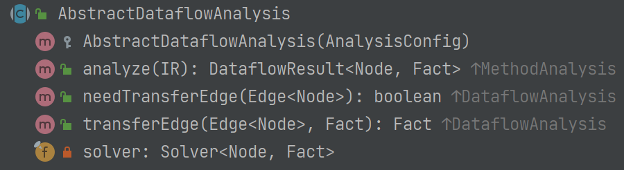 |

AbstractDataflowAnalysis这里继承了MethodAnalysis，因为还可能有其他的分析，例如方法外分析

> 这里我们仅仅讨论的是方法内分析，因此继承了MethodAnalysis和DataflowAnalysis
>
> 如果是其他类型的分析可能会继承其他的类

#### constprop

最终的区别就在于analysis.constprop这个包内

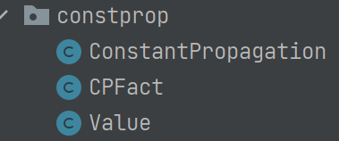

> 首先回顾data-flow analysis的DLF的定义
>
> A data flow analysis framework (**D**, **L**, **F**) consists of:
>
> - **D**: a **direction** of data flow: forwards or backwards
>     - 不包括Control Flow的merge function
>     - 决定使用$$OUT[B] = ∧_{S\space a\space sucessor\space of\space B}\space IN[S]$$还是$$IN[B] = ∧_{\space P\space a\space predecessor\space of\space B}\space OUT[P]$$
>     - 但是meet operator一般是由may/must analysis决定的
> - **L**: a **lattice** including domain of the values **V** and a  meet ⊓ or join ⊔ operator
>     - 一般要么使用meet，要么使用join(所以实际上只需要是semilattice即可，但是使用Lattice，后续介绍may/must Analysis的时候使用Lattice效果更直观)
>     - 涉及Control Flow的merge function，即meet Operation，meet operation∧实际上可以理解为这里的`join ⊔`或者`meet ⊓`
>     - 例如在available expression Analysis中，其使用的就是集合的`meet ⊓`，即∩
>     - Data-flow Analysis的域就是Lattice，其merge operation就是可以使用lattice的join/meet的操作，在data-flow Analysis的过程中就是对Lattice的操作
>
> - **F**: a family of **transfer functions** from V to V
>     - 一般每一个Node都有各自的Transfer Function，包括各自的gen和kill参数(一般Data Flow Analysis都是这样的格式)
>     - Transfer Function也是作用在lattice的域V上的参数

##### Value

Abstraction Data，应该是一个complete lattice，在constprop中的lattice如下

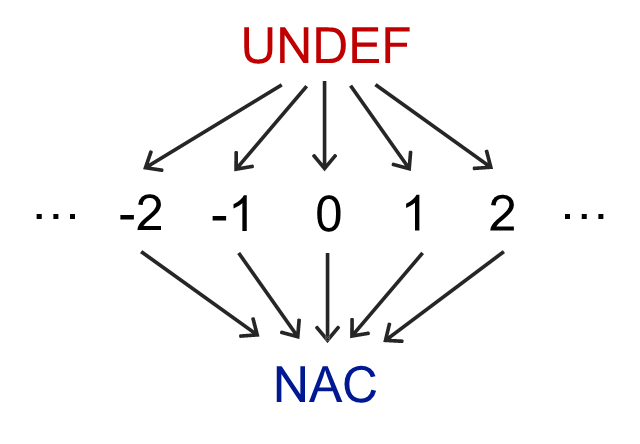

这里包中的Value就仅仅是定义了其中的值，包括UNDEF，NAC和Constant等等

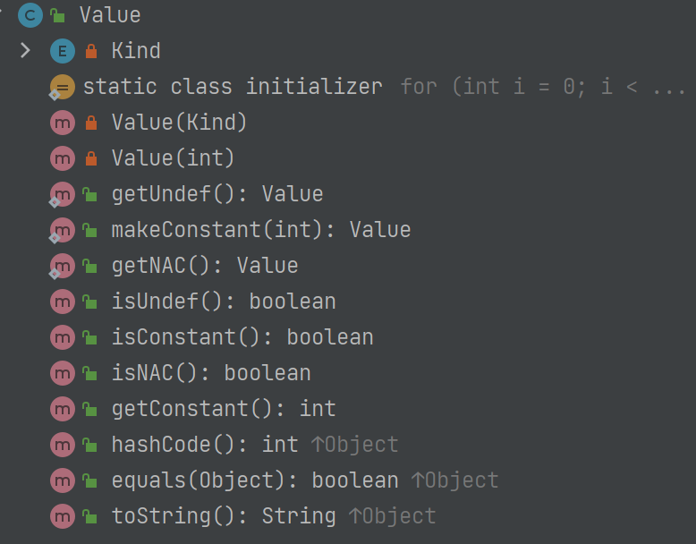

> 这个类中的很多编程技巧都可以学习一下，例如缓存，多个NAC和UNDEF实际上是同一个对象，设置**内部枚举**来标识每个变量的类型，而且一个特点是将常量也抽象成为了对象，而不是用int来表示

但是对于一个完整的Lattice，还包括meet/join操作，这个在后续的analysis的`meetInto()`中会体现

##### CPFact

这个是为这个方法特定使用的一个Fact，其实可以直接使用原本提供的MapFact或者SetFact的，例如Live Variable就是直接使用的SetFact，但是这里继承重新定义了CPFact，是因为有一些特定的操作

```java
public class CPFact extends MapFact<Var, Value>
```

如上，Fact就是`<Var, Value>`的Pair的集合，也就是一个Map

CFFact本质就是MapFact，但是有一些特殊的规则

例如如果某个变量的Value是UNDEF，那么就可以从Map中删除，也就是如果不存在在Map中，那么就是UNDEF

> (个人理解)这也是因为在Lattice中，T就是UNDEF，而constprop是must analysis，最初的状态就是T

```java
@Override
public Value get(Var key) {
    return map.getOrDefault(key, Value.getUndef());
}

@Override
public boolean update(Var key, Value value) {
    if (value.isUndef()) {
        // if the client code sets variable key to UNDEF,
        // then we remove the variable from the CPFact
        // as we use absence to represent UNDEF.
        return remove(key) != null;
    } else {
        return super.update(key, value);
    }
}

@Override
public CPFact copy() {
    return new CPFact(this.map);
}
```

##### ConstantPropagation

这个类表示了data-flow analysis的一些属性

```java
public class ConstantPropagation extends AbstractDataflowAnalysis<Stmt, CPFact>
```

> DataflowResult<Node, Fact>的泛型分别为Node和Fact，这里的ConstantPropagation继承的泛型为<Stmt, CPFact>，可见这里采用statement作为Node(之前我们学习过以block作为statement)，而CPFact是

data-flow analysis的目的的第二种说法

- Data-flow analysis is to find a solution to a set of **safe-approximation- directed constraints** on the IN[s]'s and OUT[s]'s, for all statements s.
    - constraints based on semantics of statements (**transfer functions**)
    - constraints based on the **flows of control**

并且在上述的DLF模型中，还缺少的内容有：

- D(direction)，也就是Forward还是backward，这个也决定了每个Node的最终的Fact是in还是out
    - Forward analysis最终需要的结果就是每个Node的Output，同时也决定了每次都需要重新计算Input
    - backward analysis反之
- L(Lattice)，现在已经有了Lattice的域，但是还需要实现meet/join操作，在这个类中的meetInto会实现
- F(Function), a family of **transfer functions** from V to V
    - 主要是每个Node(这里是Stmt)的Transfer function，用于将In Fact转化为Out Fact

总之，需要处理的就是这些内容

对于Direction，通过isForward()来表明方向

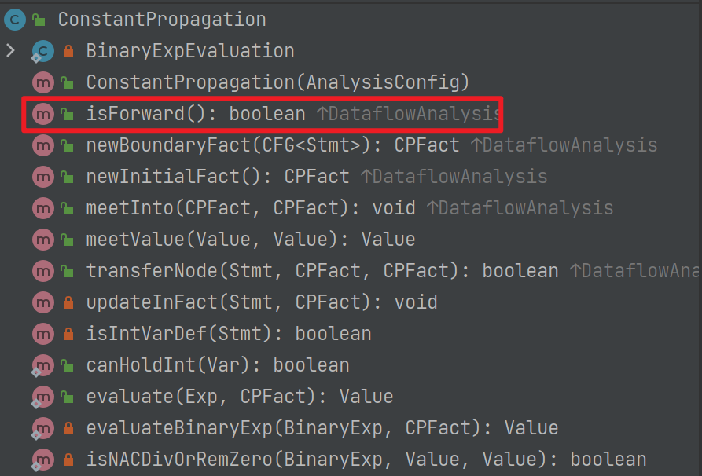

对于Lattice的meet操作，通过MeetInto()来实现

根据目前的情况，如果Fact是Set，那么就是对Set进行Fact，如果是Map，那么就是对相同key的Value进行meet(当然不排除后续还有其他的操作)

同时还有`transferNode(Stmt, CPFact in, CPFact out)`的方法，这里是根据stmt，将in转化为Output（其余的方法都是自定义的）

###### initial

在analysis中还需要定义

```java
@Override
public CPFact newBoundaryFact(CFG<Stmt> cfg) {

    CPFact boundaryFact = new CPFact();
    Value nac = Value.getNAC();

    for (Var param : cfg.getIR().getParams()) {
        if (canHoldInt(param)) {
            boundaryFact.update(param, nac);
        }
    }

    return boundaryFact;
}

@Override
public CPFact newInitialFact() {
    return new CPFact();
}
```

- 对于boundary Fact，一般都是empty(但是这里需要对函数的参数进行保守化处理，设置为NAC，因此这里做了特殊处理)
    - 之前介绍过，Fact一般为Set或者Map，boundary一般都为空

> 这里也体现出了IR的作用，可以获取所有的参数，其类型都是Var

- 对于initialFact，对于must analysis，initial Fact都应该为T，但是由于自定义了CPFact，如果某个元素不存在于Map中，就默认为UNDEF，也就是T，因此这里只需要直接返回一个空的CPFact，也就是所有的元素都为UNDEF

### Solver

有了上述定义的analysis之后，下面就可以进行Solver来进行分析了

> 上述的analysis仅仅定义了分析的一些属性和操作，可以理解为规律，但是实际上执行分析还是要依靠solver进行

如下是分析的步骤

| Iteration                                                    | Worklist                                                     |
| ------------------------------------------------------------ | ------------------------------------------------------------ |
| 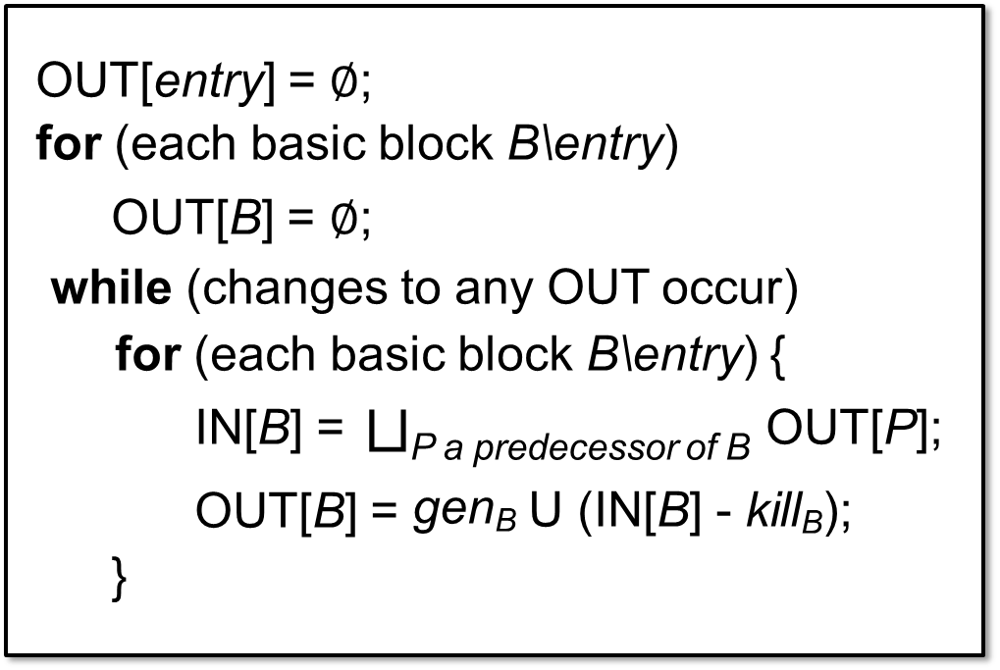 | 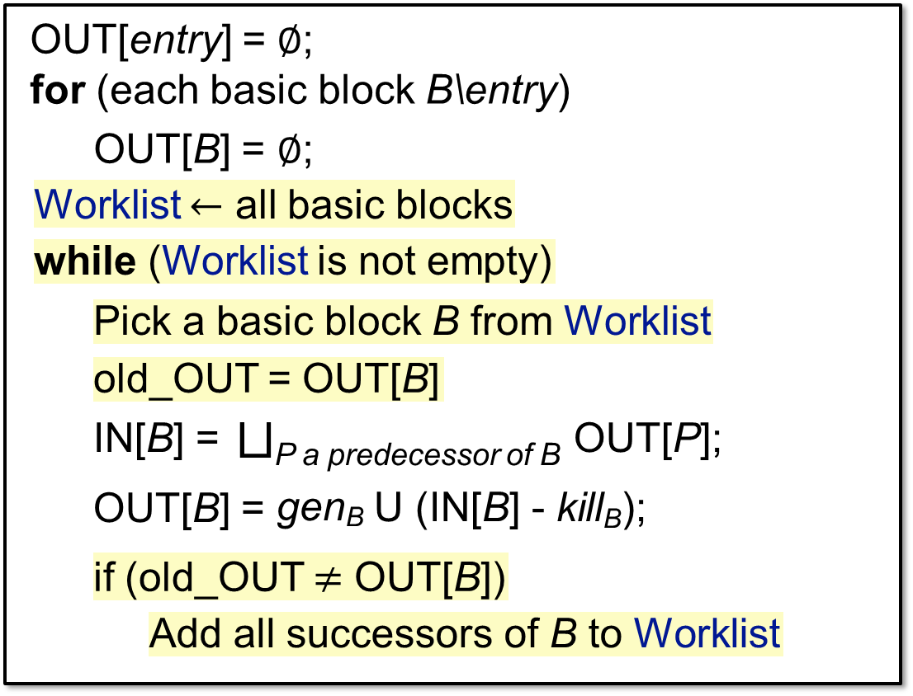 |

包括初始化和迭代的过程，在solver就是按照这个过程进行的，其中的一些关键操作，例如MeetInto，Transfer已经是在analysis中实现了的

#### Solver

在solver中包含了analysis的成员，后续的一些关键操作都是通过analysis进行的

```java
public abstract class Solver<Node, Fact> {
    protected final DataflowAnalysis<Node, Fact> analysis;
}
```

这里的Node和Fact面向了所有泛型，所以**后续的操作与实际的Node和Fact没有任何关系，仅仅与analysis提供的接口有关**

Solver分为iteration和Worklist（实际上Worklist使用的更多），二者在后续迭代的时候的步骤不同，但是都有相同的初始化操作，根据`analysis.isForward()`来进行`initializeForward`或者`initializeBackward`

```java
/**
     * Creates and initializes a new data-flow result for given CFG.
     *
     * @return the initialized data-flow result
     */
private DataflowResult<Node, Fact> initialize(CFG<Node> cfg) {
    DataflowResult<Node, Fact> result = new DataflowResult<>();
    if (analysis.isForward()) {
        initializeForward(cfg, result);
    } else {
        initializeBackward(cfg, result);
    }
    return result;
}

/** Set the initial (output) fact of each node and the boundary fact of entry node. */
protected void initializeForward(CFG<Node> cfg, DataflowResult<Node, Fact> result) {
    for (Node node : cfg.getNodes()) {
        result.setOutFact(node, analysis.newInitialFact());
        result.setInFact(node, analysis.newInitialFact());
    }
    result.setOutFact(cfg.getEntry(), analysis.newBoundaryFact(cfg));
}

protected void initializeBackward(CFG<Node> cfg, DataflowResult<Node, Fact> result) {
    throw new UnsupportedOperationException();
}
```

- 在调用solver之前，框架会将程序编译得到IR并且构建CFG，因此CFG可以直接使用
- analysis已经定义了boundary Fact和initial Fact，因此这里调用`analysis.newInitialFact()`和`analysis.newBoundaryFact(cfg)`设置
- 设置的内容加入到DataflowResult中

但是留了两个方法是空缺的，需要子类实现

```java
private void doSolve(CFG<Node> cfg, DataflowResult<Node, Fact> result) {
    if (analysis.isForward()) {
        doSolveForward(cfg, result);
    } else {
        doSolveBackward(cfg, result);
    }
}

protected abstract void doSolveForward(CFG<Node> cfg, DataflowResult<Node, Fact> result);

protected abstract void doSolveBackward(CFG<Node> cfg, DataflowResult<Node, Fact> result);
```

#### Worklist Solver

```java
class WorkListSolver<Node, Fact> extends Solver<Node, Fact>
```

这个继承了Solver，包括中的analysis变量，在Solver中已经实现了通用的initial的操作，后续迭代的操作就是Worklist中实现的了

主要的过程就是`doSolveForward()`，


注意点：

- 由于是Forward analysis，需要自己定义一个`calInFact()`的方法，根据preds的outFact，进行MeetInto操作得到该节点的inFact
- `transNode`已经返回了某个Node的Output是否发生了改变，因此`if(old_OUT != OUT[B])`可以直接通过这个返回值来比较
- 在向Worklist中添加数据的时候，可以先判断是否已经有了，避免重复添加