# 对新添加的类的分析

第四个作业在前面的三个作业的基础上添加了许多的类

## graph

首先是增加了很多graph相关的类，包括CallGraph和ICFG


### call graph

#### CallGraph Interface

首先是CallGraph interface，里面仅仅定义了接口

```java
public interface CallGraph<CallSite, Method> extends Graph<Method>, StmtResult<Set<Method>>
```

这里给出了泛型是CallSite和Method，并没有明确的类型，可能有变化吧，但是在课程中学过了: ==**Essentially, a call graph is a set of call edges from call-sites to their target methods**==

后续会给出泛型，下面是其中的方法

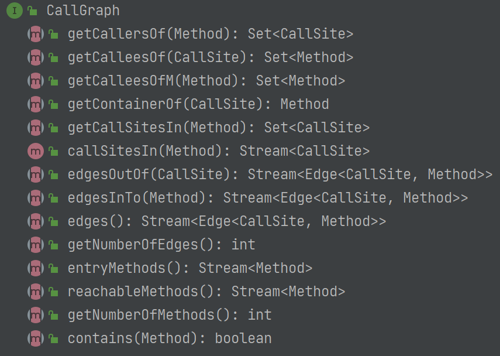

这里面的Method和CallSite都是泛型

CallGraph本质上都是函数之间的连接

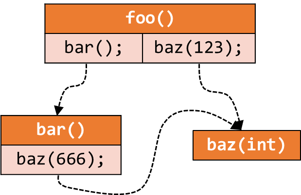

和之前的CFG一样，能够从一个点得到所有与其相邻的点，例如上述的`getCallersOf()`和`getCalleeOf()`

#### AbstractCallGraph

这里面是CallGraph的默认实现

```java
public abstract class AbstractCallGraph<CallSite, Method> implements CallGraph<CallSite, Method>
```

但是泛型仍然保留，可以看到其中已经定义了很多的map结构了，而且方法也得到了基本的实现

```java
public abstract class AbstractCallGraph<CallSite, Method>
        implements CallGraph<CallSite, Method> {

    protected final MultiMap<CallSite, Edge<CallSite, Method>> callSiteToEdges = Maps.newMultiMap();
    protected final MultiMap<Method, Edge<CallSite, Method>> calleeToEdges = Maps.newMultiMap();
    protected final Map<CallSite, Method> callSiteToContainer = Maps.newMap();
    protected final MultiMap<Method, CallSite> callSitesIn = Maps.newMultiMap(Sets::newHybridOrderedSet);
    protected final Set<Method> entryMethods = Sets.newSet();
    protected final Set<Method> reachableMethods = Sets.newSet();
}
```


#### DefaultCallGraph

```java
public class DefaultCallGraph extends AbstractCallGraph<Invoke, JMethod>
```

这里已经有了类型了，CallSite用Invoke来表示，Method用JMethod来表示

> CallGraph，仅仅是CallSite和target Method的连接，但是Invoke和JMethod的行为其根本不关心

这里新实现了几个方法

- `addEntryMethod()` 因为在构建CG的时候是需要有entrymethod的
- `addReachableMethod()`
- `addEdge()`，<del>继续沿用了之前的泛型Edge，但是</del>类型改为了Invoke→JMethod的方法了

```java
public class DefaultCallGraph extends AbstractCallGraph<Invoke, JMethod> {

    /**
     * Adds an entry method to this call graph.
     */
    public void addEntryMethod(JMethod entryMethod) {
        entryMethods.add(entryMethod);
    }

    /**
     * Adds a reachable method to this call graph.
     *
     * @return true if this call graph changed as a result of the call,
     * otherwise false.
     */
    public boolean addReachableMethod(JMethod method) {
        if (reachableMethods.add(method)) {
            if (!method.isAbstract()) {
                method.getIR().forEach(stmt -> {
                    if (stmt instanceof Invoke invoke) {
                        callSiteToContainer.put(invoke, method);
                        callSitesIn.put(method, invoke);
                    }
                });
            }
            return true;
        }
        return false;
    }

    /**
     * Adds a new call graph edge to this call graph.
     *
     * @param edge the call edge to be added
     * @return true if the call graph changed as a result of the call,
     * otherwise false.
     */
    public boolean addEdge(Edge<Invoke, JMethod> edge) {
        if (callSiteToEdges.put(edge.getCallSite(), edge)) {
            calleeToEdges.put(edge.getCallee(), edge);
            return true;
        } else {
            return false;
        }
    }
}
```

其中主要的几个方法

- `CallSiteIn`，返回一个方法中的CallSite，例如如下foo()中的bar()和baz(123)


#### CallGraphs & CallKind

这是CallGraph的工具类，不可以实现

其中最关键的方法就是

```java
public static CallKind getCallKind(InvokeExp invokeExp)
```

从参数中可以看到，CallKind是由InvokeExp决定的(这是新得到的Exp)

Kind就是课程中学到的Java的类型，是一个枚举，如下是作业中的描述

> 在本次作业中，你需要处理 Java 语言的四种方法调用：`invokestatic`、`invokespecial`、`invokeinterface` 和 `invokevirtual`（已经在第 7 讲介绍过了哦）。当然，Java 中的一些新特性会让方法调用的情形更复杂：比如 Java 8 开始允许接口定义非抽象方法（default methodsopen in new window）；还有从 Java 11 开始，invokeinterface 和 invoke-virtual 可以调用 private 方法了。这都会使我们构建调用图的过程变得更复杂。而简单起见，你并不需要在本次作业中处理这些改动。

其中invokeinterface和invokevirtual都算是virtual call

但是实际上的实现是

```java
public static CallKind getCallKind(InvokeExp invokeExp) {
        if (invokeExp instanceof InvokeVirtual) {
            return CallKind.VIRTUAL;
        } else if (invokeExp instanceof InvokeInterface) {
            return CallKind.INTERFACE;
        } else if (invokeExp instanceof InvokeSpecial) {
            return CallKind.SPECIAL;
        } else if (invokeExp instanceof InvokeStatic) {
            return CallKind.STATIC;
        } else if (invokeExp instanceof InvokeDynamic) {
            return CallKind.DYNAMIC;
        } else {
            throw new AnalysisException("Cannot handle InvokeExp: " + invokeExp);
        }
    }
```

所以说可以看到本质上是根据invokeExp来判断的，所以说可以直接判断，但是还是用函数封装了这种蕾西

#### callgraph.Edge

CallGraph有独有的Edge类

```java
public class Edge<CallSite, Method>
```

泛型包括了CallSite和Method

如下是一些方法

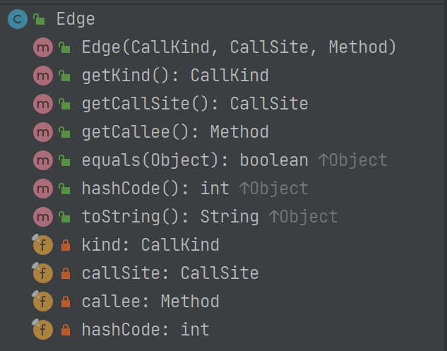

callSite, callee和Kind也可以获取，关键是可以从Edge得到Kind

在创建的时候不仅仅需要两个端点，还需要CallKind

#### MethodEdge

这里本次作业还没有使用，暂时先不做讲解

#### CGBuilder & CHABuilder

CGBuilder是Call Graph Builder，是一个接口，在课程中介绍过很多的构建call graph的方法，所以只提供了一个接口

```java
interface CGBuilder<CallSite, Method> {

    CallGraph<CallSite, Method> build();
}
```

CHAbuilder就是实现了这个接口

### icfg

#### ICFG Interface

```java
public interface ICFG<Method, Node> extends Graph<Node>
```

本身继承了Graph，同时也是一个泛型，这里的泛型是Node和Method

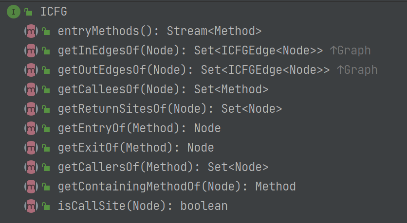

#### ICFGEdge

```java
public abstract class ICFGEdge<Node> extends AbstractEdge<Node> {

    private int hashCode = 0;

    ICFGEdge(Node source, Node target) {
        super(source, target);
    }
}
```

抽象类，这里创建的方式只有Node

其下有4个子类

ReturnEdge

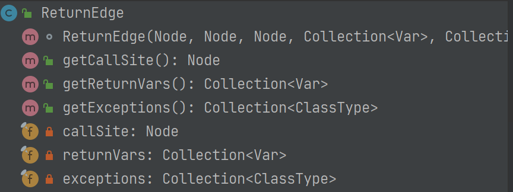

CallEdge

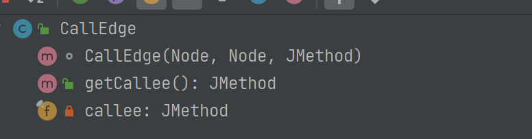

## IR

接下来是IR中的一些新增的内容

### exp.InvokeExp

```java
public abstract class InvokeExp implements RValue
```

这是一个RValue，还是个抽象类，说明在包中隐藏了一些实现类

其中的方法如下

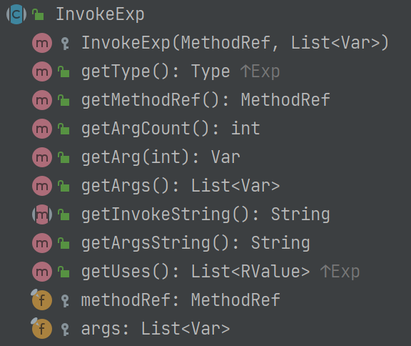

这里的getType不是call type，而是exp的type

其中可以获取一些参数，最主要的方法，得到参数的信息和`MethodRef`，MethodRef是比较关键的信息，后续会介绍

可以看到在创建的时候是需要MethodRef和Var作为参数，所以MethodRef就相当于某个类中的某个方法的引用

### stmt.Invoke

新增了一个Invoke的Stmt

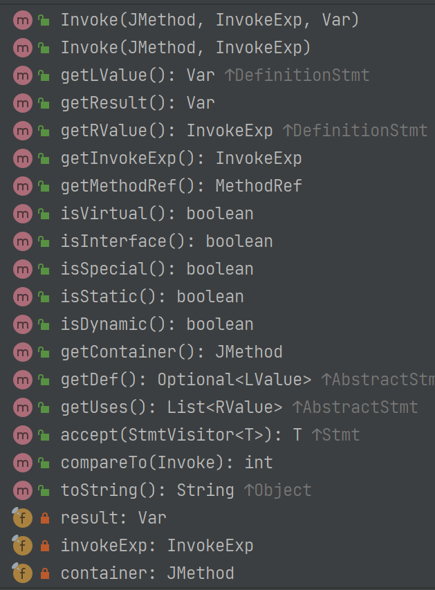

其实这些实现主要是判断的，但是看其中的实现

```java
public boolean isVirtual() { return invokeExp instanceof InvokeVirtual; }
public boolean isInterface() { return invokeExp instanceof InvokeInterface; }
public boolean isSpecial() { return invokeExp instanceof InvokeSpecial; }
public boolean isStatic() { return invokeExp instanceof InvokeStatic; }
public boolean isDynamic() { return invokeExp instanceof InvokeDynamic; }
```

这里面含有Interface call的类型

==**但是总之invoke是可以直接判断类型的**==

其实都是依据其中的invokeExp实现的，所以本质上还是invokeExp

```java
public MethodRef getMethodRef() {
    return invokeExp.getMethodRef();
}
```

包括getMethodRef()也是如此

### proginfo.MethodRef

```java
/**
 * Represents method references in IR.
 */
@InternalCanonicalized
public class MethodRef extends MemberRef
```

这个包表示的是程序的信息，是一个Method的引用，可以在包中查看到还有其余的类型

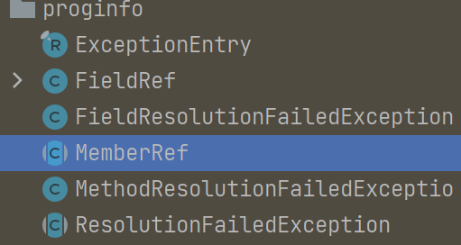

这是MethodRef的一些方法

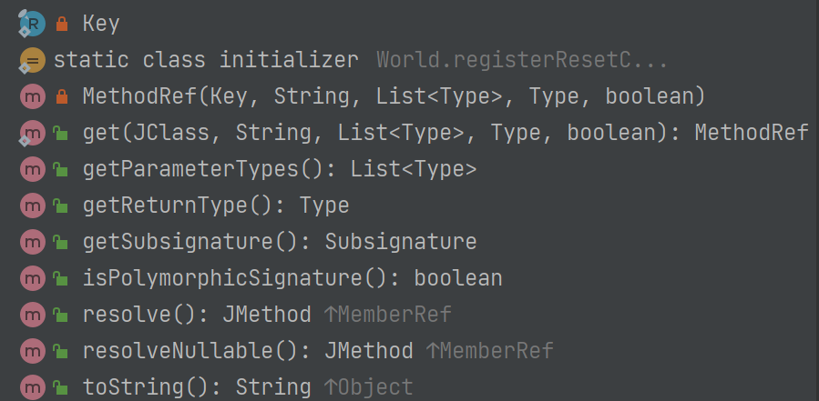

这里能够得到参数类型，返回值类型，还有Subsignature(后续会介绍)

> ```
> pascal.taie.ir.proginfo.MethodRef
> ```
>
> Tai-e 中的目标方法引用，如调用点的目标方法。它包含了调用点所调用的目标方法的签名信息。
>
> - JClass getDeclaringClass()：返回该方法签名的声明类，即声明该方法的类。（也就是所描述的 class type，声明时的类型）；
> - Subsignature getSubsignature()：返回被调用方法的子签名（subsignature）。稍后我们回来介绍子签名类——Subsignature。

在静态分析的时候，是无法准确判断出运行时类型的，只能从代码中判断出编译时类型

---

MethodRef继承的MemberRef，指代的是某一个成员的引用？

InvokeExp里面含有MethodRef, 说明就是在callSite那里，有一个InvokeExp，然后其指向的方法的引用，JMethod是一个实际的，具体的引用。

所以说MethodRef仅仅是一个引用，JMethod是一个明确定义的方法，但是MethodRef是可以得到类的吗？

## lang

这个作业多出了一个lang的包

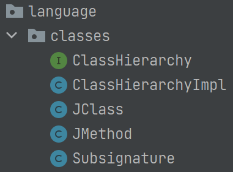

这个包可以当做反射，将源文件中的代码映射到了类中，通过类来获取信息

### ClassHierarchy

- `pascal.taie.language.classes.ClassHierarchy`

    该类提供了类层次结构的相关信息。

    - `Collection<JClass> getDirectSubclassesOf(JClass)`: 对于给定类，返回直接继承该类的子类。
    - `Collection<JClass> getDirectSubinterfacesOf(JClass)`: 对于一个给定接口，返回直接继承该接口的子接口。
    - `Collection<JClass> getDirectImplementorsOf(JClass)`: 对于一个给定接口，返回直接实现了该接口的类。

举个例子，在下面的 class hierarchy 中，I, II, III 是接口，其他均为类：

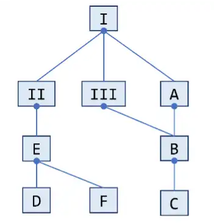

那么

- `getDirectSubclassesOf(A) = [B]`
- `getDirectSubinterfacesOf(I) = [II, III]`
- `getDirectImplementorsOf(II) = [E]`

> 这里面提供的方法都不是静态方法，因为好像还有可以赋值的成员变量，所以不是很懂，后续可能会用到，这里还不会用到

### JClass

```java
/**
 * Represents classes in the program. Each instance contains various
 * information of a class, including class name, modifiers, declared
 * methods and fields, etc.
 */
public class JClass extends AbstractResultHolder implements Annotated {}
```

下面是一些方法

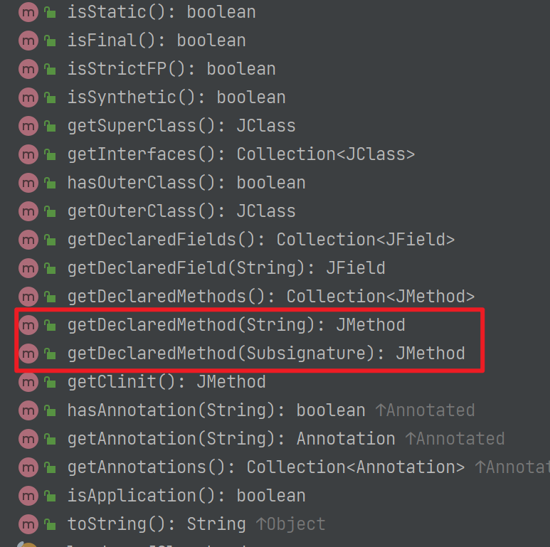

- DeclaredMethod(就是在源代码中声明的方法，可能是抽象方法)，根据SubSignature来获取JMethod
- 或缺的JMethod可能是一个abstract Method，也可能是constructor，可以在JMethod提供的接口中判断
- 可以通过JMethod获取superclass，因为在定义类的时候就会声明superclass，但是无法得知谁继承了，需要Hierarchy来获取subclass

### JMethod

```java
/**
 * Represents methods in the program. Each instance contains various
 * information of a method, including method name, signature, declaring class,
 * method body (IR), etc.
 */
public class JMethod extends ClassMember {}
```

在静态分析中就可以作为

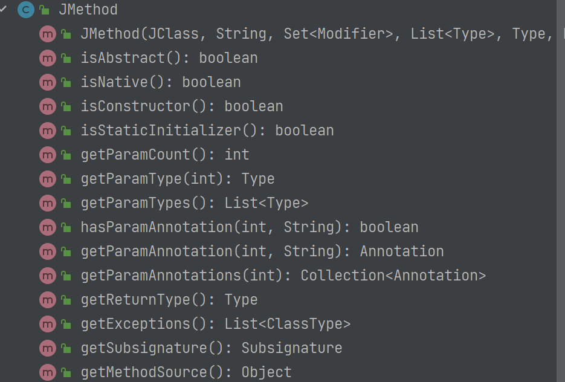

- 这个JMethod是绑定了JClass的，明确表明是在哪个JClass中的哪个方法
- 还可以表示抽象方法，即没有函数体的方法

### SubSignature

该类表示 Tai-e 中的子签名。一个方法的子签名只包含它的方法名和方法签名的描述符。举个例子，下面方法 foo 的子签名是：“T foo(P,Q,R)” ，而它的完整签名是：“<C: T foo(P,Q,R)>”。

```java
class C {
    T foo(P p, Q q, R r) { … }
}
```

也就是说，这个signature是仅仅包含签名，但是与JClass不绑定

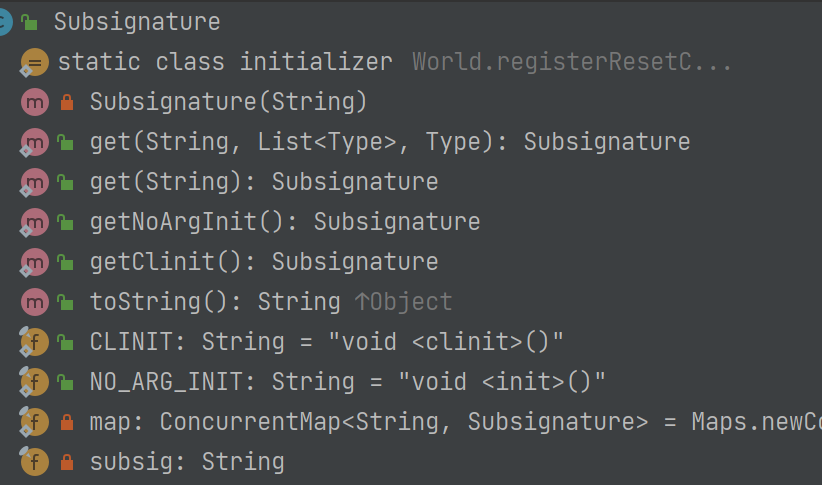

## Dataflow

### analysis

#### inter

这个包内指的是过程间分析的接口

##### InterDataflowAnalysis

这是一个接口，使用泛型，里面的方法也都没有实现，给其他的过程间数据量分析提供了模板

```java
public interface InterDataflowAnalysis<Node, Fact>
```

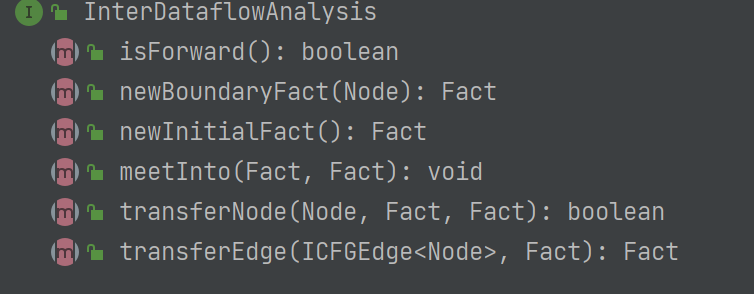

##### AbstractInterDataflowAnalysis

抽象类，给出了一些基础的实现，但是仍然使用泛型

```java
public abstract class AbstractInterDataflowAnalysis<Method, Node, Fact> extends ProgramAnalysis implements InterDataflowAnalysis<Node, Fact>
```

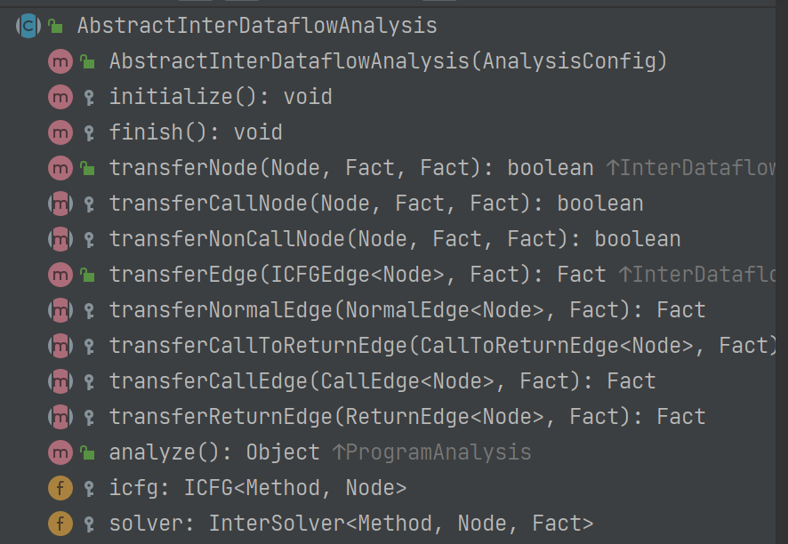

##### InterConstantPropagation

```java
public class InterConstantPropagation extends
        AbstractInterDataflowAnalysis<JMethod, Stmt, CPFact> {

    // ...

    private final ConstantPropagation cp;
}
```

继承了AbstractInterDataflowAnalysis，实现了其中的方法，这也是本节课中要实现的方法

里面含有ConstantPropagation，其实内部的实现就是调用了其方法，只不过有一些新的实现


##### InterSolver

```java
class InterSolver<Method, Node, Fact>
```

这个和之前的Solver的作用很像，但是仍然采用了泛型。所以说Node，Fact是怎样的这里根本不关心，仅仅调用上述analysis的接口